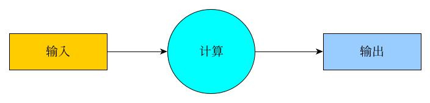

# 1、治理国家要面对的终极问题是什么？
## 公平 和 效率
(这两个问题互相矛盾，就像民主和集权，人治和法治)
# 2、处理一件事情，从理性的角度来讲，要面对的终极问题是什么？
## 代价 和 效率
## 或者
## 付出 和 回报

# 3、计算，本质上还是处理事情或想法，官方点的讲法：
## 处理信息
###   以最小的代价处理最多(广义)的信息
####  本质上是解决最优化问题，即我们的结果是：更快、更好、更廉价(反正是从众生之欲)

 计算的本质是什么？  
 答：机械化的信息处理  
http://www.yinwang.org/blog-cn/2018/04/13/computer-science (引用自计算机科学家王垠)

# 4、计算本质上包含的两个要素是什么？
## 数据 和 处理
(此处"处理"的同义词：函数表达式、指令、算法、计算、运算)
# 5、计算本质上包含的三个要素是什么？
输入、计算、输出

# 6、计算机
## 6.1冯·诺伊曼结构-现代计算机的基础结构
### 维基百科参考
英文：https://en.wikipedia.org/wiki/Von_Neumann_architecture

中文：https://zh.wikipedia.org/wiki/%E5%86%AF%C2%B7%E8%AF%BA%E4%BC%8A%E6%9B%BC%E7%BB%93%E6%9E%84#%E5%86%AF%C2%B7%E8%AF%BA%E4%BC%8A%E6%9B%BC%E7%93%B6%E9%A0%B8

结构图：  
https://en.wikipedia.org/wiki/Von_Neumann_architecture#/media/File:Von_Neumann_Architecture.svg

## 6.2冯氏计算机体系可分为三大部分

> ## 输入设备
>> ### 键盘、鼠标、摄像头、外置传感器等等
> ## 计算系统
>> ### 运算单元
>>>CPU的组成部分
>>### 存储单元
>>>硬盘、内存等等 是CPU的组成部分
> ## 输出设备
>> 音响、显示屏等等

# 7、计算模型
即我们可以把计算机看成一个如下模型：
  

当然这里面有一个(短期、长期)存储问题
# 8、计算机的根
> ### 计算机实际上是模拟人的部分思维方式，而又把人从繁琐机械重复的劳动中解放出来，最终是为人类服务的，本质上是机械而非智能。
> ### 人类的思维方式，其中比较简单、明确的、目前流行的一种方式是自希腊时代苏格拉底、柏拉图、亚里士多德三师徒总结的形式逻辑。
> ### 形式逻辑是人类思维方式的总结之一，最大的也是唯一的特点是：追求明确性。
> ### 形式逻辑的优点：明确性，形式逻辑的缺点：明确性。
> ### 人类是矛盾的，充满了确定性和不确定性。
> ### 人类的思维方式有很多种，这个很多种是无限种，因为人类是智能的。
> ### 计算机科学虽然是机械的而非智能的，但是人类赋予了它人类的想象力，所以不得不说计算机科学是比较伟大的。
> ### 人类的想象力是无限的，可现实要遵从利益驱使、人欲驱使，所以计算机科学这栋大厦既有其美妙的部分，也有其丑陋的东西，所以
> ### 不要迷信计算机科学，但也不要无脑的鄙视之，要理解的去尊重，也要理解的去批评。就像一个有智慧的人批判的、全面的、动态的、
> ### 辩证的看待世界。

> ## 8.1、形式逻辑
参考:https://zh.wikipedia.org/wiki/%E9%80%BB%E8%BE%91
>> ### 形式逻辑规律
>>> #### 1、同一律
>>>> 即 A=A (显然A不等于A以外的东西，这里有个隐含的前提：即A这个概念是明确的)
>>> #### 2、无矛盾律
>>>> 即，在A这个概念已经确定的前提下，判断一件事物是否是A，只有一种答案：是或否，二选一
>>> #### 3、排中律
>>>> 即，在A已经确定的前提下，判断一件事物是否是A，只有两种答案可选：是和否，没有第三种答案
>>> #### 4、充足理由律(因果律)
>>>> 任何事物都有其存在的充足理由。(这个很复杂，涉及到不确定性，不应该放到形式逻辑里面)
> ## 8.3、形式逻辑追求的是确定性、准确性、静态的

> ## 8.3、二进制
>> ### 1、二进制是计算系统里面最简单的计数系统(显然0进制，1进制不行，也不存在意义)，可扩展性最好(可能表示任何大于2的计数系统)
>> ### 2、二进制可以完全表示形式逻辑
>> ### 3、计算机要跑起来，能量来源是“电”，二进制能表示有电和没电，还有什么计数方式比这更好的契合这一切因素 (效率和代价要踩跷跷板嘛)

# 9、"算盘计算"与"现代计算机计算"比较
从其内核思想、原理上来讲，现代计算机就是古代算盘的加强版，以中国算盘为例，算盘和计算的对比:

类型|输入设备|计算规则|处理设备|计算进制|内部存储|外部存储|输出设备|是否拥有智能
----|---|------|-------|---------|--------|------------|------|-------
中国算盘|算珠|四则运算|人脑|十进制|算盘和人的大脑|纸张等|算珠|没有
现代计算机|键盘、鼠标等|四则、逻辑|CPU|二进制(其他进制可转化)|各级内存|硬盘等|音响、显示屏|没有

(拥有智能的定义：离开了人的操作，是否可以有自主的决策行为)
> ## 结论
>> ### 1、他们显然都满足计算的核心要素
>> ### 2、显然他们从本质上是一类的，就像猫和老虎(广义的，不钻牛角尖)，可是他们是“机械”，“机器”，不是人
>> ### 3、计算机把人类从重复的可替代的劳动中解放出来，人类用计算机实现自己的想象力
>> ### 注意：输入和输入设备的区别，在“输入->计算->输出”这个模型里面，输入代表原来的状态或者原始数据，输出代表计算处理后的状态或处理后的数据，而输入设备只是输入的内容的载体，输入是抽象的概念(无实体)，输入设备是实体。
# 10、编程角度的计算机工作原理

### 从较抽象，较高的层次讲，这里面包含两个主体部分(当然人类其实才是幕后黑手，不谈)，其他部分都围绕他们展开：
> #### 1、数据  
> #### 2、处理

# 11、编程角度的计算要素
> ## 1、数据
>> ### a、基础的数值 (基础数据类型相关的)
>> ### b、变量和赋值 (基础数据的使用)

> ## 2、处理
>> ### a、表达式  
>>> (基础计算相关的，包括基本的算术表达式，逻辑表达式)
>> ### b、结构化语句处理  
>>> (提高效率的操作，属于语句块级别;如顺序、循环、条件结构，嵌套、递归等处理)
>> ### c、功能模块  
>>> (提高效率的操作，属于功能模块级别;如函数和函数调用)
>> ### d、其他技术
>>> #### 1、泛化(泛型、模板)  
>>>> 本质上是数据类型的扩展，以特征衡量类型(满足条件的类型都可以使用其包含的功能，把类型当参数)
>>> #### 2、指针(引用)  
>>>> 指针是一个动作概念(动词)，而变量却是描述概念(名词)
>>> #### 3、类型推导  
>>>> 有关数据类型转换的问题，可能有性能和内容上的损耗，想象一下不同大小的纸盒子，如何互相放进去
>>> #### 4、面向对象  
>>>> 面向对象是功能模块的扩展，关注静态的属性和动态的行为，把这二者关联性较高的特征放到一块，组成“类”，通常以现实概念为参照
>>> #### 5、垃圾处理  
>>>> 内存管理的艺术(手动处理和自动处理，同样要面对代价和效率的问题)
# 12、杂谈
## 现代科学解读
### 科学的定义：  
> ### 1、维基百科:https://zh.wikipedia.org/wiki/%E7%A7%91%E5%AD%A6
>> #### 科学是通过经验实证的方法，对现象（原来指自然现象，现泛指包括社会现象等现象）进行归因
>> ### 科学涵盖三方面含义：
>>> ####  观察
>>>> 致力于揭示自然真相，而对自然作用由充分的观察或研究（包括思想实验），通常指可通过必要的方法进行的，或能通过科学方法——一套用以评价经验知识的程序而进行的。
>>> ####  假设
>>>> 通过这样的过程假定组织体系知识的系统性。
>>> ####  检证
>>>> 借此验证研究目标的信度与效度。
#### 2、胡适对治学的定义：大胆假设,小心求证
#### 3、根据现代科学的定义与事实，我对科学的理解：
> #### a、科学是一种认识世界、研究世界的方法 (目的)
> #### b、科学的依据是：把人类过去遗留下来的事实，其中以科学方法认为是对的挑选出来，作为科学的依据 (属于创世纪"要有光"那一步) (前提)
> #### c、科学方法的本质是形式逻辑(前三个规律) (本质)
> #### d、科学显然追求确定性(按照指示他人可得到相同或相似的结果)，看得到、摸得着、听的见、闻得到、尝得出(但是科学无法研究感觉得到的东西) (研究范围)
> #### e、科学的具体方法是：在原有的依据前提下，作出假设、通过反复实验(有方向性、针对性的试错、检验)、得出一个结论与原有假设对比 (方法)
> #### e、科学认可的条件:确定性,而确定性本身却是一个不确定性的标准（比如:0.0001 在不同精度下，可能等于0，也可能大于0,而科学却用的是一个精度）
> #### f、所以，科学以其认可的依据为前提，以假设为开端，以实验为检验者，以最终结论为证据(成为新的依据)，来解释世界 (定义)

## 中医与西医 太极阴阳体系与形式逻辑体系 动态分析与静态描述 道家与一神教 释道儒三教合一

## 科学 真理 权威认证 大多数信服的理论
## 人类创造了很多理论(发现了很多规律)，或多或少都与人有关系，可是理论是绝对理想的，而现实却是很现实的。相对理想主义(理想现实主义)可能比绝对理想主义更靠谱。
## 理想追求的是真理还是自以为是的真理
## 理想状态是一颗橘树，人类、人心、世界却是土壤，“橘生淮南为橘，生淮北为枳”，这个问题是我们要考虑的，也是总是被选择性忽略的，因为人总是倾向于关注眼前。
